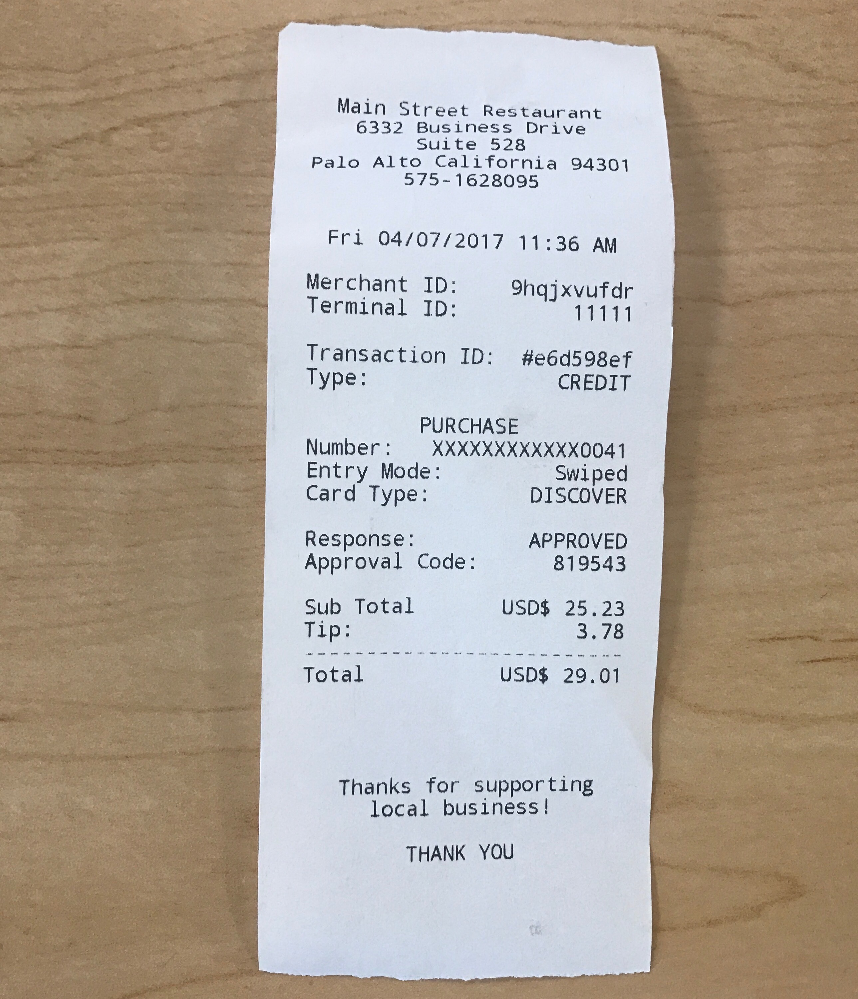
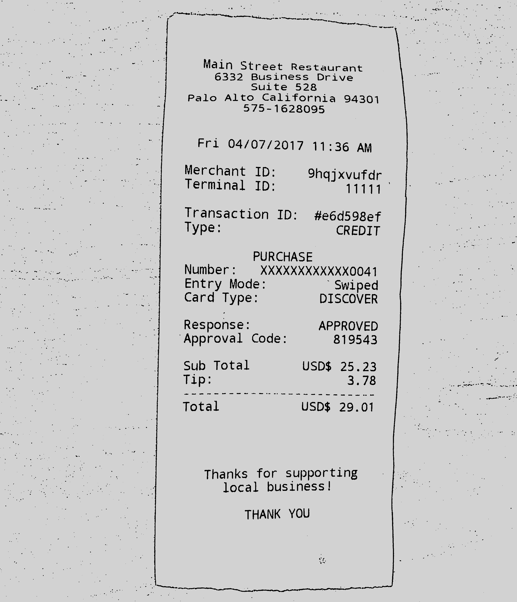
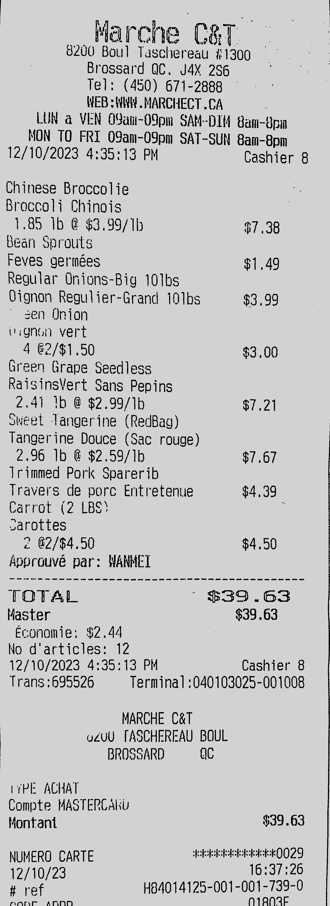
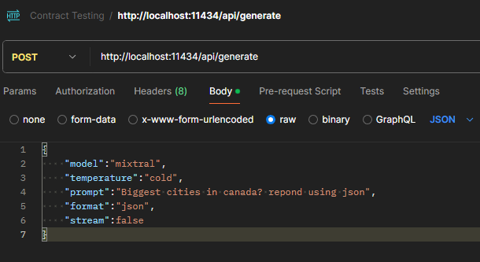
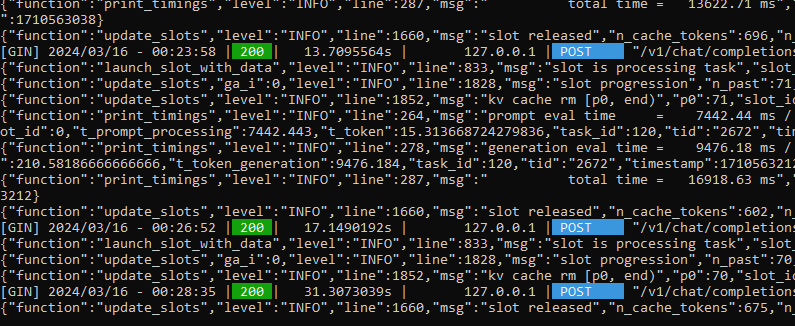

# imgToText
An OCR tool using Tesseract 4.1.1 with the pytesseract librabry to read an image and OpenCV to pre process and prepare the image for better OCR results. Currently implementing a local host LLm model mixtral through OpenAI api to further cross check and enhance the accuracy of the OCR result

The program will check the TODO folder to check if there's any image to convert, if there is it will call the img_to_string() function from the img_processing_main.py. The function would process the image, then use tesseract to scan the recipe and return a json object with another function calling to the chatopenai.py

To download Tesseract: https://github.com/UB-Mannheim/tesseract/wiki

To process and improve read quality: https://github.com/tesseract-ocr/tessdoc/blob/main/ImproveQuality.md

# EXAMPLE
From  To 
The digitized result:

{
"name": "Main Street Restaurant",
"location": "6332 Business Drive Suite 528, Palo Alto California 94301",
"cardType": "Discover",
"amount": "29.01"
}
From  To 
The digitized result:
{
"name": "Marche C&T",
"location": "8200 Boul Taschereau #1300, Brossard QC J4X 256",
"cardType": "MasterCard",
"amount": "39.63"
}
# LLM model
The model being used is a Mixtral-8x7B that's on the local network, bound to port 11434 and can be access via a curl 
 
or in this case through OpenAI api and its library with python.
Example of an api being call:
