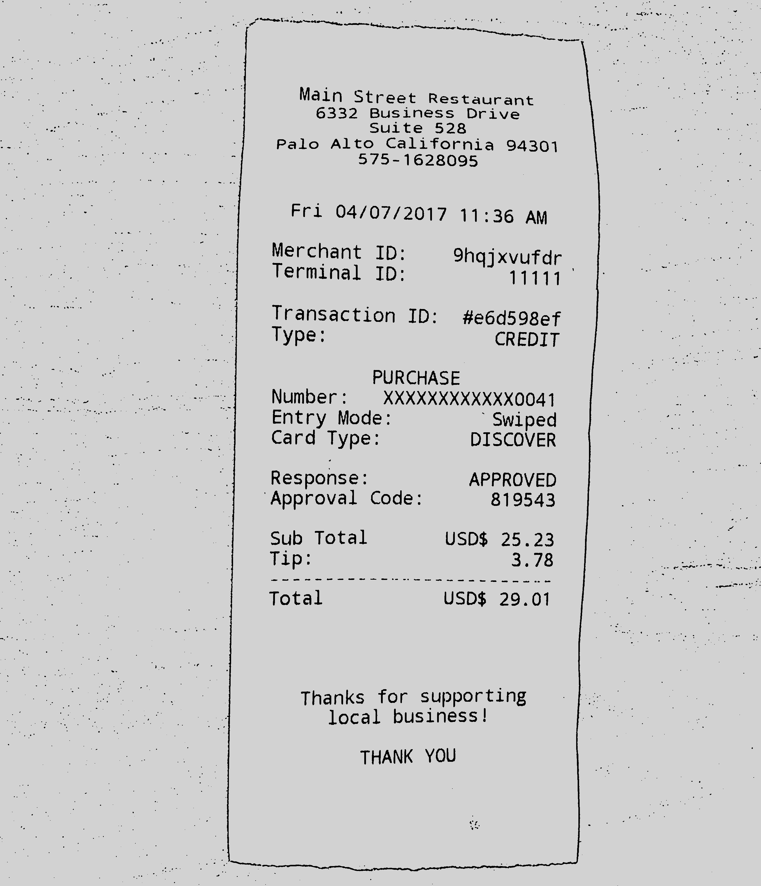
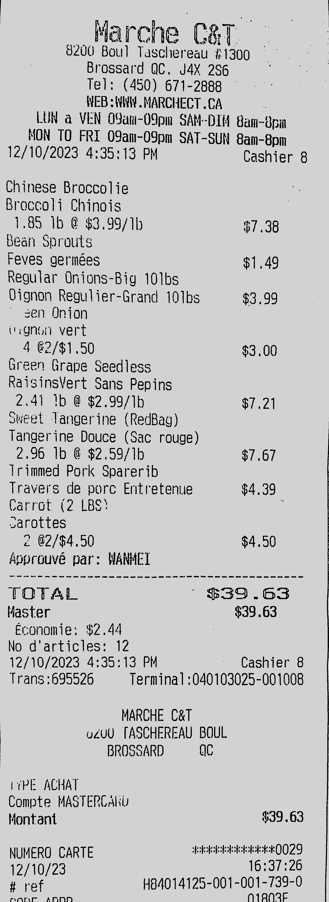

# imgToText
An OCR tool using Tesseract 4.1.1 with the pytesseract librabry to read an image and OpenCV to pre process and prepare the image for better OCR results. Currently implementing a local host LLm model mixtral through langchain to further cross check and enhance the accuracy of the OCR result

The program will check the TODO folder to check if there's any image to convert, if there is, it will use tesseract to read words from an image of a receipt and will return a JSON object with the information read from the receipt.

To download Tesseract: https://github.com/UB-Mannheim/tesseract/wiki

To process and improve read quality: https://github.com/tesseract-ocr/tessdoc/blob/main/ImproveQuality.md

# EXAMPLE
From  To 
The digitized result:

Main Street Restaurant
6332 Business Drive
Suite 528
Palo Alto California 94301
575-1628095

Fri 04/07/2017 11:36 AM

Merchant ID: 9hqjxvufdr
Terminal ID: 11111

Transaction ID: #e6d598ef
Type: CREDIT

PURCHASE
Number : XXXXXXXXXXXXOO4 I
Entry Mode: ' Swiped
Card Type: DISCOVER
Response: APPROVED
�Approval Code: 819543
Sub Total USD$ 25.23
Tip: 3.78

wee me ee eee mes sn

Total USD$ 29.01

Thanks for supporting
local business!

THANK YOU

From  To 
The digitized result:
Marche C&T

8200 Boul Taschereau #1300

Brossard QC. J4X 256
Tel: (450) 671-2888
WEB : WWH.MARCHECT CA

LUN a VEN O9an-09pm SAM-DIM Gam-8pm
NON TO FRI OSam-O9pm SAT-SUN Sam-8pm

12/10/2023 4:35:13 PM

Chinese Broccolie
Broccoli Chinois

1.85 Ib @ $3,99/1b
Bean Sprouts
Feves germ�es
Regular Onions-Big 101bs
Qignon Regulier-Grand 101bs
~ sen Onion

Uagnon vert

4 �2/$1.50

Green Grape Seedless
RaisinsVert Sans Pepins

2.41 Ib @ $2.99/lb

sweet Tangerine (RedBag)
Tangerine Douce (Sac rouge)

2.96 lb @ $2.59/ib
Trimmed Pork Sparerib
Travers de pore Erntretenue
Carrot (2 LBS

varottes

2 62/$4.50

Approuve par: WANMET

�_ 1 ont are em Ga men ome
ee me wre mame mm tee ee oe ee we re ee ee oe ee oe ow oe ee

TOTAL
Master
Economie: $2.44
No d'articles: 12
12/10/2023 4:35:13 PH

Cashier 8

$3.99
$3.00
$7.21

$7.67
$4.39

Cashier 8

Trans :695526 Terminal :040103025-001008

MARCHE C&T

uZUU TASCHEREAU BOUL
BROSSARD QC

hiPE ACHAT

Compte MASTERCAKU |
Montant $39.63
NUMERO CARTE dolekekactacd kz O02 9
12/10/23 No
# ref H84014125-001-001-739-

rvoiwrm AnnNnN

NIRAN2E
